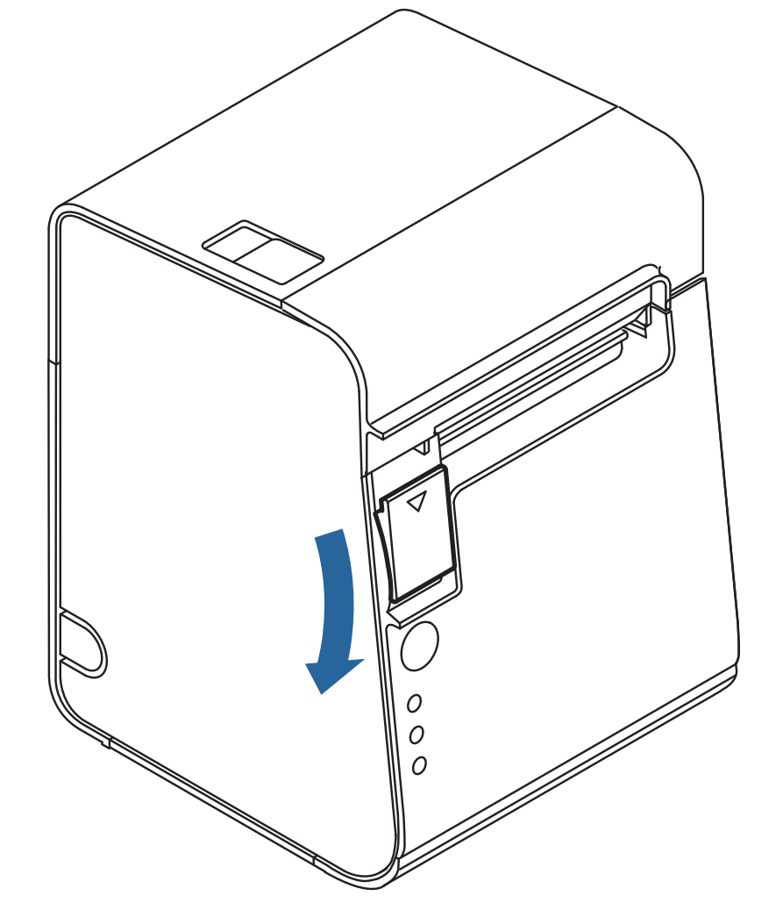
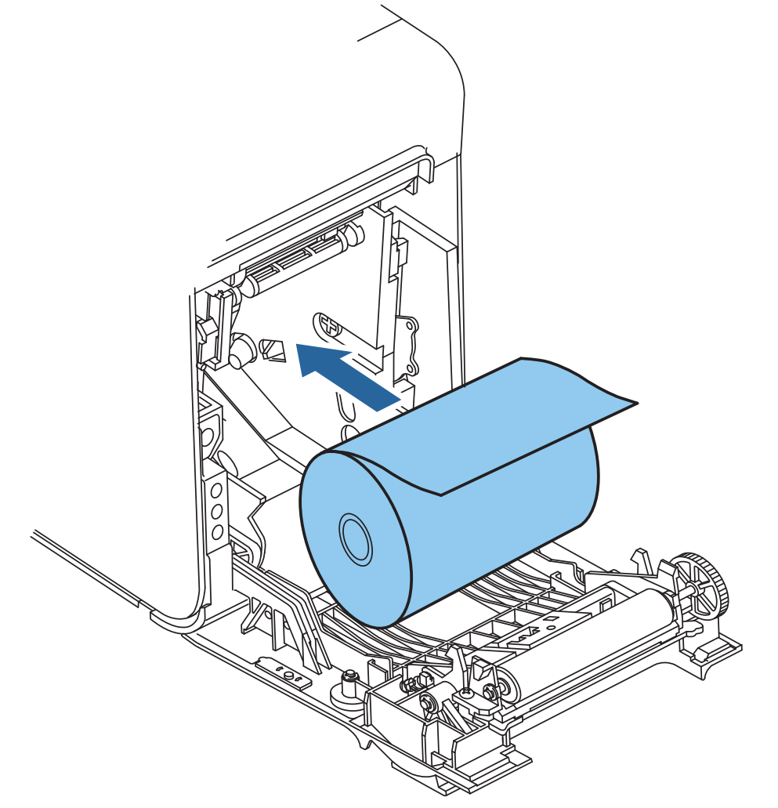
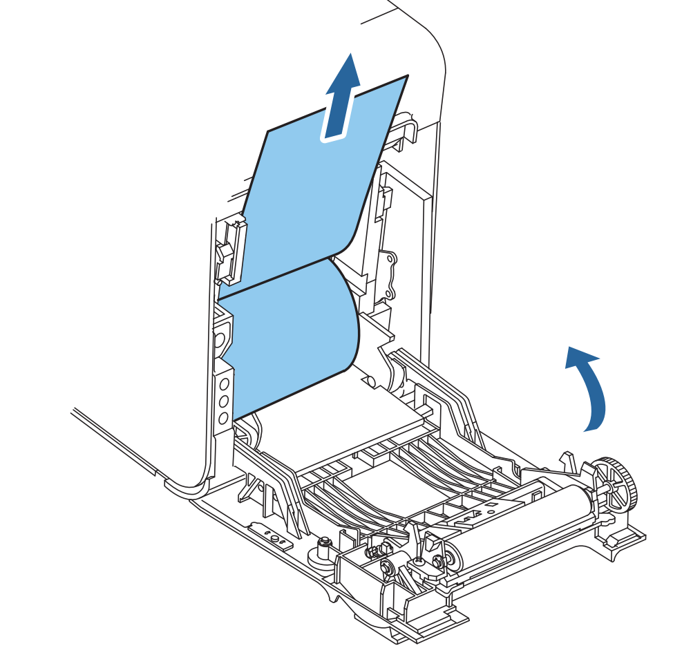

# プリンタの用紙交換
## 交換タイミング
用紙の両端に赤いラインが見え始めたとき
## 交換方法
1. カバーオープンレバーを引いてカバーを開ける

2. 古いロールを取り出す
3. 新しいロールを向きに気を付けて入れる

4. ロールの先がカバーからはみ出すようにして、カバーをしっかり閉める

5. 電源ボタンを押す

# ラベルの印刷（印刷キュー）
レジ・マスター・CaOS は、印刷したいラベルを印刷キューに積むだけです。プリンターにつないだ端末が、積んだ順に 1 件ずつ印刷します。
同時に積まれても抜けず、同じラベルを 2 回印刷することもありません。

## 印刷する端末の設定
- プリンターにつないだ端末（ふだんはレジの iPad）でレジの画面を開き、右上の「この端末で印刷する」をオンにする
  - 設定は端末ごとに残る（ブラウザーの localStorage）。オンにしている間は、どの画面を開いていても印刷する（呼び出し画面を除く）
  - 横に「プリンター接続完了」と出ていれば印刷できる。「プリンター未接続」なら「再接続」を押す
- 印刷する端末を 2 台にしても、1 件のラベルはどちらか 1 台だけが印刷する

## 印刷できなかったとき
- 失敗したラベル、印刷中のまま 1 分たっても終わらないラベル、30 秒以上待っているラベルがあると、
  印刷する端末とレジ・マスターの画面の左下に出る
- 「もう一度印刷」で印刷し直す。いらなければ「取り消す」

## 緊急のシール
- マスターの画面で、カップの右上の「緊急」を押して「印刷する」を押す
- 「緊急」とだけ書いたシールが出て、そのあとにそのカップと全く同じシール（レジで出たもの）が出る